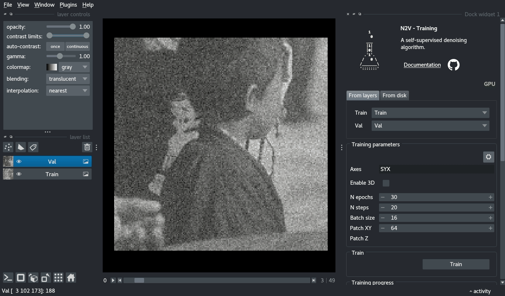

# napari-n2v

`napari-n2v` brings Noise2Void to the fantastic world of napari. N2V is a sef-supervised denoising algorithm allowing 
removing pixel-independent noise. It also includes an extension, structN2V, aimed at removing structured noise.

This set of plugins can train, retrain and predict on images from napari or from the disk. It conveniently allows saving 
the models for later use and is compatible with [Bioimage.io](https://bioimage.io/#/). 

# Documentation

1. [Installation](installation.md)
2. [Documentation](documentation.md)
3. [Examples](examples.md)
4. [Troubleshooting](faq.md)

# Report issues and errors

Help us improve the plugin by submitting [issues to the Github repository](https://github.com/juglab/napari-n2v/issues) or tagging @jdeschamps on [image.sc](https://forum.image.sc/). 

# Cite us

## N2V

Krull, Alexander, Tim-Oliver Buchholz, and Florian Jug. "Noise2void-learning denoising from single noisy images." *Proceedings of the IEEE/CVF conference on computer vision and pattern recognition*. 2019.

## structN2V

Broaddus, Coleman, et al. "Removing structured noise with self-supervised blind-spot networks." *2020 IEEE 17th International Symposium on Biomedical Imaging (ISBI)*. IEEE, 2020.
